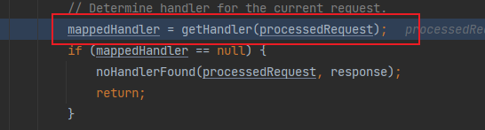
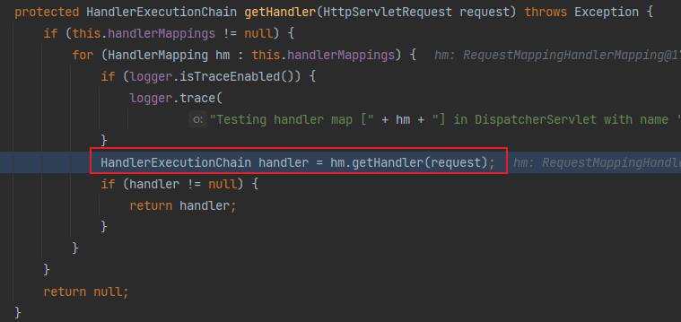
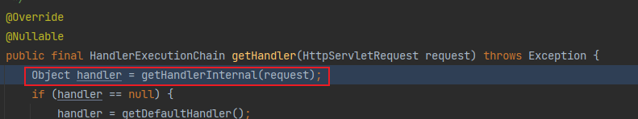
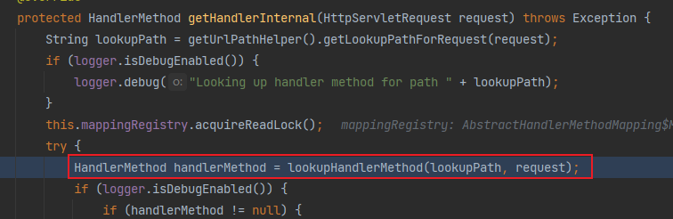
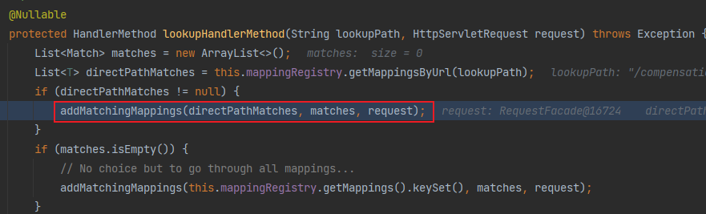
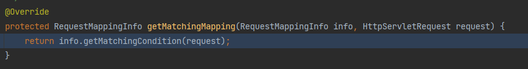
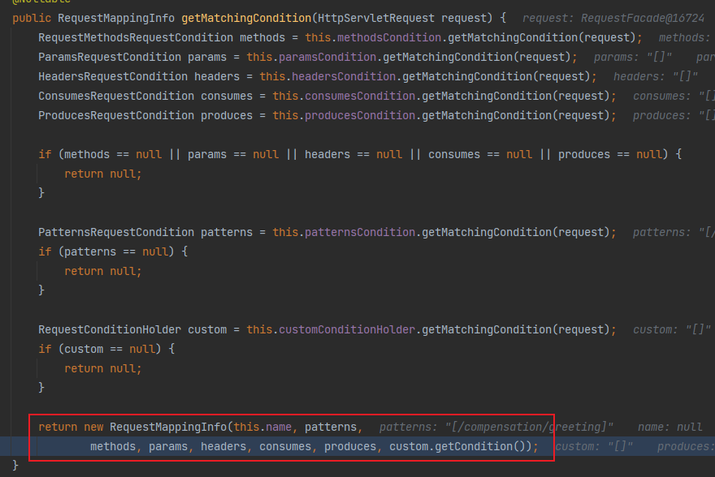

## Spring mvc HandleMapping 过程

顺序如下

 1.  `DispatcherServlet.doDispatch`方法内的`getHandler(processedRequest);` 
 2.   `调用同一个类 `DispatcherServlet.getHandler`方法内的`HandlerExecutionChain handler = hm.getHandler(request);`
 3. 调用`AbstractHandlerMapping.getHandler`方法内的`getHandlerInternal(request);`
 4. 调用`AbstractHandlerMethodMapping.getHandlerInternal`方法内的`HandlerMethod handlerMethod = lookupHandlerMethod(lookupPath, request);`
 5. 调用`AbstractHandlerMethodMapping.addMatchingMappings`方法内的`getMatchingMapping(mapping, request);`
 6. 调用`RequestMappingInfoHandlerMapping.getMatchingMapping`方法内的`info.getMatchingCondition(request);`
 7. 调用`RequestMappingInfo.getMatchingCondition`方法内，最后返回`RequestMappingInfo`

> `RequestMappingInfo`可以看成是`@RequestMapping`注解解析后的对象信息